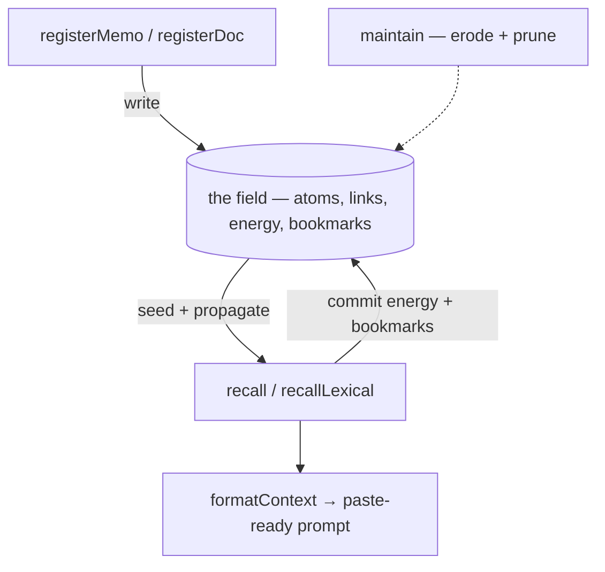
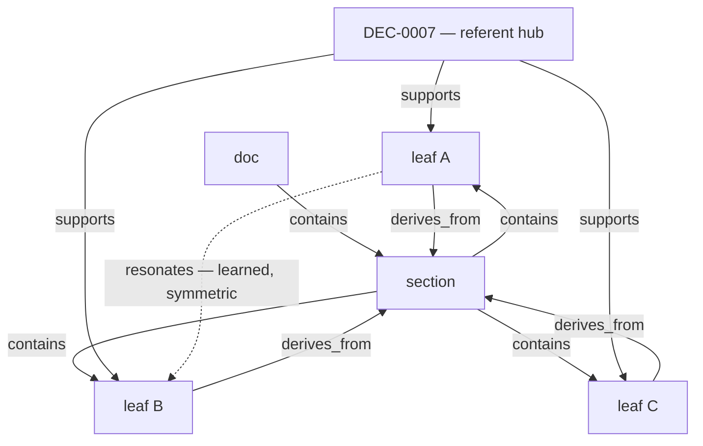
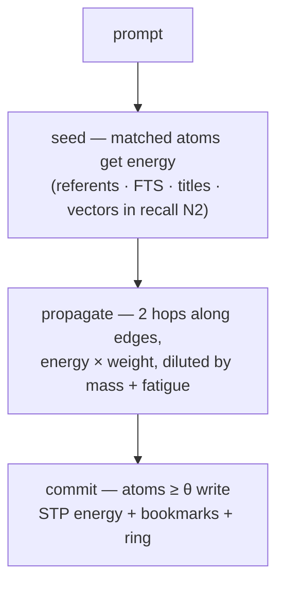
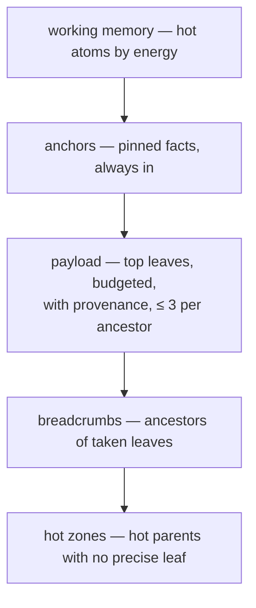
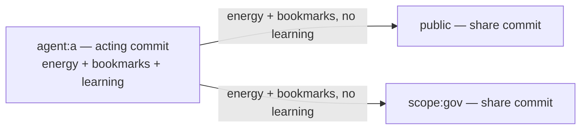

# How `@ytrynot/osem-rag` works

> Oscillo Ergo Memini — a deterministic memory-field engine in local SQLite. This document explains the physics: what an atom is, how a query becomes a wave, what gets remembered, and what gets forgotten.

## Table of Contents

- [Mental model](#mental-model)
- [The cadastre: atoms, links, planes](#the-cadastre)
- [A recall, step by step](#a-recall-step-by-step)
  - [1. Seeding — four surfaces](#1-seeding--four-surfaces)
  - [2. Propagation — the wave](#2-propagation--the-wave)
  - [3. Commit — STP vs LTP](#3-commit--stp-vs-ltp)
- [The two memories](#the-two-memories)
  - [STP: working memory (`agent_energy`)](#stp-working-memory)
  - [LTP: windowed frequency (`bookmarks` + `freq_buckets`)](#ltp-windowed-frequency)
- [Forgetting and fatigue](#forgetting-and-fatigue)
- [Injection — from field to context](#injection--from-field-to-context)
- [Memory planes and sharing](#memory-planes-and-sharing)
- [Honest silence](#honest-silence)
- [Maintenance (`maintain`)](#maintenance-maintain)
- [Determinism](#determinism)
- [Known limitations](#known-limitations)

---

## Mental model

OSEM is not a vector database with a recency filter. It is a **field**: atoms of knowledge sit in a graph, a query injects energy at a few surfaces, the energy propagates along edges, and whatever crosses a threshold becomes the context. Everything that happened is written down — heat, bookmarks, spread, fatigue — so the next query starts from a memory, not from scratch.

Two timescales coexist:

- **STP (short-term plasticity)** — _this agent's_ working memory: what was recently hot for `agent:X`, decaying fast.
- **LTP (long-term plasticity)** — _per-scope_ windowed frequency: how often each attention domain actually surfaced an atom over its recent commits, measured from an append-only log rather than simulated by a decay state.

The four public operations map to two directions — write and read:



Registration writes the graph; a recall reads the field **and writes back** — that feedback loop is the memory.

| Step                            | Direction     | What happens                                                     |
| ------------------------------- | ------------- | ---------------------------------------------------------------- |
| `registerMemo` / `registerDoc`  | write → field | inserts atoms, provenance edges, FTS index, embeddings           |
| recall step 1: seed + propagate | field → read  | the field's atoms and edges energize the wave                    |
| recall step 2: commit           | write → field | hot atoms write STP energy + one bookmark each + ring increments |
| `formatContext`                 | read          | renders the working memory into a paste-ready block              |
| `maintain`                      | write → field | erodes learned edges, prunes dead ones, refreshes stats          |

## The cadastre

Everything lives in your SQLite database (you own the connection):

| Table                        | Role                                                                                                                   | Timescale            |
| ---------------------------- | ---------------------------------------------------------------------------------------------------------------------- | -------------------- |
| `atoms`                      | the knowledge units (id, body, kind, flag, src/line provenance) — including `kind='query'` atoms, one per recall       | —                    |
| `bookmarks`                  | append-only truth: `(query_id, scope_id, atom_id, seq, w, via, path)` — "this commit surfaced this atom on this scope" | LTP                  |
| `freq_buckets`               | derived ring cache of bookmark mass per bucket — rebuildable from `bookmarks`, never trusted on its own                | LTP                  |
| `scope_clock`                | each scope's own commit counter `seq` — the window index                                                               | LTP                  |
| `scope_owner`                | first writer = scope owner (pin certification, `actAs` gating)                                                         | LTP                  |
| `atom_links`                 | typed edges: `contains`, `derives_from`, `supports`, `resonates`                                                       | structural / learned |
| `agent_energy`               | per-(atom, scope) working-memory energy                                                                                | STP                  |
| `edge_gain` / `edge_fatigue` | learned edge weights and synaptic fatigue                                                                              | adaptive             |
| `surface_log`                | maintenance/audit log (pruning events — forgetting is always traced)                                                   | audit                |
| FTS5 + vec0                  | lexical index and optional native vector index                                                                         | surfaces             |

An **atom** is one fact: a sentence, a row, a section. Parents exist too — `fts: false` atoms that are reached by propagation only (they are context, never payload).

**Edges**: `derives_from`/`contains` come from ingestion hierarchy; `supports` links atoms to the referents they cite (`DEC-0006`, file paths); `resonates` is the learned channel — edges the field itself creates between co-surfaced atoms, with a gain that grows on reuse and erodes on neglect.



Leaves cite the same referent → the hub connects them. `doc`/`section` are structural parents (`fts:false`): reached by propagation, rendered as breadcrumbs, never payload.

## A recall, step by step

`recallLexical({ agentId, prompt })` runs the lexical wave only (`mode: "lexical"`). `recall` always adds the second step (adjacent terms + vector surface) — or pass `mode: "vec"` to fuse lexical and vector seeds into a single wave.



### 1. Seeding — four surfaces

The prompt is decomposed into referents (governance ids, file paths), FTS5 terms (BM25-weighted, IDF-priced), and title matches. A fifth channel — vector similarity — fires in `recall`'s second step. Each surface injects energy at the atoms it matches; an atom hit by several surfaces gets interference (`srcs` tells you which).

### 2. Propagation — the wave

Energy flows along edges for up to two beam-bounded levels:

```text
e_neighbor = e_source × decayProp × w_edge
           / max(1, mass_from)
           / (1 + λ·uses_edge)
           / √(1 + β·din_to)
```

- `decayProp` discounts each hop; `w_edge` depends on the edge type — `supports` = 2 (3 when the deposited atom is `pinned`), `derives_from` = 1, `contains` = `weightContains` (0.3) — modulated by learned `edge_gain` and synaptic `edge_fatigue` (`uses_edge`, `lambdaFatigue`);
- `mass_from` normalizes by the source's fan-out (a hub cannot push its full energy down every edge); `din` dilution (`betaDin`) prevents high in-degree atoms from irradiating everything — propagation is geometric in depth (`wⁿ`), so distance costs energy.

### 3. Commit — STP vs LTP

The commit is eager and atomic, and it always happens **after** the wave — a query never sees its own bookmarks. One commit writes, in a single transaction:

- the **query atom** (`kind='query'`, id `qry:<actingScope>:<seq>`) — the prompt stored verbatim, a slim `atoms` row only: no FTS index, no embeddings, excluded from every surface forever;
- `seq + 1` on the acting scope (and on each mirror scope that receives a share commit — silent recalls never commit on mirrors);
- one **bookmark** per surfaced atom, weighted `w = e_atom / n_commit` (the atom's own wave energy over the commit's surfaced count — a commit that surfaces 50 atoms cannot write 50× the credit of a surgical one);
- the **ring increments** in `freq_buckets`;
- the STP energy bump in `agent_energy`;
- graph learning (`resonates`, hebbian gain, edge fatigue) — acting plane only.

Bookmarks record the wave's committed surfacing, not the injected payload — an atom above `theta` but crowded out of the budget still counts: budget capping is a rendering concern, not a memory one.

> **Privacy**: prompts are persisted verbatim as query atoms — they are the provenance anchors of bookmarks. Never put secrets in queries.

## The two memories

### STP: working memory

`agent_energy(atom_id, scope_id)` holds each plane's current heat. It decays multiplicatively on every recall (`decaySession`), so yesterday's activation fades unless refreshed. This is the _context of now_: what this agent — or this scope — has been thinking about.

| Plane    | Address        | Who reads it                               | What it holds                               |
| -------- | -------------- | ------------------------------------------ | ------------------------------------------- |
| personal | `agent:<id>`   | only that agent                            | own STP energy + bookmarks + clock + owner  |
| shared   | `public`       | every agent (default read)                 | mirrored energy + bookmarks (share commits) |
| domain   | `scope:<name>` | callers passing `scopes: ["scope:<name>"]` | mirrored energy + bookmarks (share commits) |
| skill    | `skill:<name>` | callers passing `scopes: ["skill:<name>"]` | mirrored energy + bookmarks (share commits) |
| union    | `"all"`        | read-only aggregate                        | every plane's energy summed                 |

Every plane is keyed `(atom, scope)` in `agent_energy` and `bookmarks`, and keeps its own monotonic `scope_clock.seq`. By default the acting plane is `agent:<id>` — but a shared scope **can** act, through its owner: `recall({ agentId, actAs: "scope:gov" })` makes the scope the acting plane (its energy, its bookmarks, its seq) if the caller is its `scope_owner`. The first agent to actAs a scope claims ownership; later non-owner claims are rejected before any write. That is how collective durable memory works: curated by the owner, never open to every mirror.

### LTP: windowed frequency

The permanent layer is **measured, not simulated**: `bookmarks` is an append-only log — one row per (commit, scope, surfaced atom) with weight `w = e_atom / n_commit`. An atom's durable importance on a scope is its share of that scope's recent commits:

```text
f20    = Σ w  over the last 20 commits     — exact, scanned on bookmarks
f50    = Σ n  over the last ~5 buckets     — read on the freq_buckets ring
f100   = Σ n  over the whole ring (10 buckets of 10 commits)
spread = occupied buckets in the ring      — dispersion across distinct commits
share(a) = ( w_recent·f20/K1 + w_warm·f50/K2m
           + w_durable·spread/NB + w0 ) / N_scope
N_scope = COUNT(DISTINCT atom_id FROM bookmarks WHERE scope_id = s)
```

Read it as:

- **`freq_buckets` is a ring of 10 slots** per (scope, atom) — `slot = bucket_id mod 10`, lazily overwritten when its bucket rolls out. It is a cache: `maintain()` rebuilds it from `bookmarks` and reports drift (`ringDrift` in the result — 0 on a healthy base).
- **`spread` replaces spacing rules**: a burst packs into few buckets; consultations spread across distinct commits fill the ring — durability (`f100 > 0 AND spread ≥ freqMinBuckets`) is a measurement, not a counter.
- **`w0` (registrationWeight)** is the "new things are findable" prior — a read-time numerator term, never a synthetic bookmark: fresh atoms get a baseline share without faking frequency or spread.
- **`N_scope` normalizes per scope**: a small scope inside a huge cadastre keeps its shares — a foreign unbookmarked corpus cannot dilute it (deposits are inert; N grows only on an atom's first bookmark).
- **Silence dilutes**: a silent recall writes its query atom and advances `seq` but no bookmarks — windows slide past the old surfacings. But only the _acting_ scope's seq advances: foreign silent recalls cannot flush a shared scope.
- **Hard edges are intentional**: windows don't ramp — a burst dies exactly when the long window slides past its buckets.
- **Flag floors stay additive** (`flagFloorWeight · floorPinned/floorHigh`): pinned truth sources keep wave presence independent of bookmarks.

There is no mutable decay state to corrupt: the truth is append-only, the ring is regenerable, and a scope nobody commits on simply freezes — its windows cannot move without events.

## Forgetting and fatigue

| Mechanism           | What it does                                                                                |
| ------------------- | ------------------------------------------------------------------------------------------- |
| window slide        | a commit's bookmarks leave the windows as `seq` advances — dilution by attention, not decay |
| STP decay           | working memory cools ×`decaySession` per recall                                             |
| `resonates` erosion | learned edges ×`erodeResonates` per `maintain`, pruned below `weightMin`                    |
| synaptic fatigue    | over-used edges transmit less (`/(1+λ·uses)`), refilling ×0.5/recall                        |
| nodal fatigue       | parents that keep surfacing get tired (bookmarks over `nodalWindow`)                        |

Nothing is deleted silently: pruning and forgetting are traced in `surface_log`.

## Injection — from field to context

`formatContext()` renders the working memory into a paste-ready block with **two pools**:

- **payload** — the leaf atoms, cited as answers with exact provenance (`source`, `section`, `lines`);
- **breadcrumbs** — their ancestors, cited as context — parents are context, never payload, and a per-ancestor diversity cap keeps one big document from eating the budget.

Pinned atoms (`flag: "pinned"`) are anchors: they bypass the energy ranking and are always available to the pool.



## Memory planes and sharing

One mechanism, four addressing modes — `agent:<id>` (private working memory), `public`, `scope:<name>`, `skill:<name>` — plus `"all"` as a read-only union. `share` on `recall`/`recallLexical` mirrors the wave's energy into shared planes without double learning.

**Every scope is an attention domain**: it owns its bookmarks (`bookmarks` keyed by `(scope_id, atom_id)`), its clock (`scope_clock.seq`, monotonic — a stale caller can never rewind a plane), and its owner (`scope_owner` — the first writer, used for pin certification). Mirrors write the same surfacings as **their own observations** — bookmarks and ring on the target scope — but graph learning (`resonates`, hebbian gain, edge fatigue) stays acting-plane only (`learn=false`).



A mirror commit is a real observation on the scope — its seq advances and the atoms earn frequency there. A _silent_ recall commits nothing on mirror scopes: foreign silence cannot dilute a scope it doesn't act on.

## Honest silence

If nothing crosses the thresholds — lexical empty AND both vector channels under their cosine gates — the engine surfaces **nothing**. No fabricated top-k, no low-confidence padding. An empty answer is a correct answer.

## Maintenance (`maintain`)

`maintain()` erodes learned edges, prunes the dead ones (traced in `surface_log`), rebuilds the `freq_buckets` ring from `bookmarks` (reporting `ringDrift` — the number of slots that had drifted from the truth), and refreshes the materialized propagation statistics (`_fan`, `_mass`, `_din`) that keep wave computation sub-linear. One `IOsemRag` handle = one writer per connection.

## Determinism

No wall-clock anywhere in the physics — and no caller clock either: each scope counts its own commits (`seq`). Same database + same prompt + same history ⇒ same wave, byte for byte. That is what makes the engine testable, replayable, and auditable.

## Known limitations

- **Weight calibration is open**: `freqWeightRecent`/`Warm`/`Durable`, `flagFloorWeight` and `registrationWeight` all start at 1.0 — the window sizes and tier boundaries are tuned, the relative weights await usage data.
- **Share magnitude fades with vocabulary growth**: `N_scope` counts distinct bookmarked atoms all-time, so absolute shares erode slowly on long-lived scopes (ranking is preserved — only the absolute boost level shrinks against the constant flag floor).
- **Query atoms accumulate**: every recall stores its prompt verbatim as a `kind='query'` atom — the provenance anchor of bookmarks. They are excluded from every surface and carry no FTS/embedding, but they are kept forever (bookmarks reference them). Don't put secrets in prompts.
