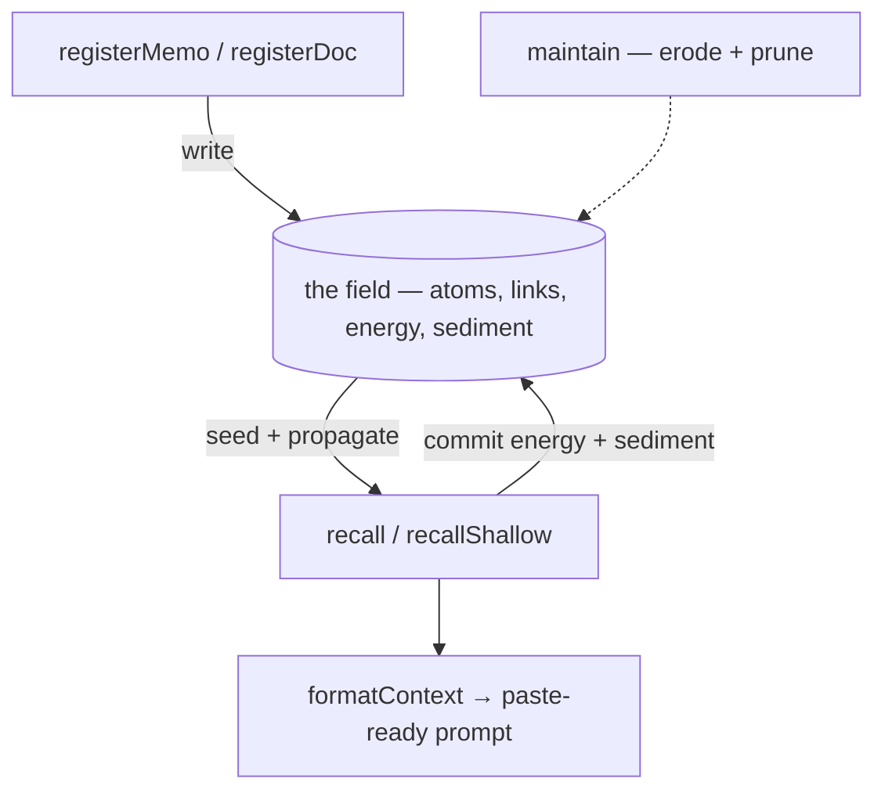
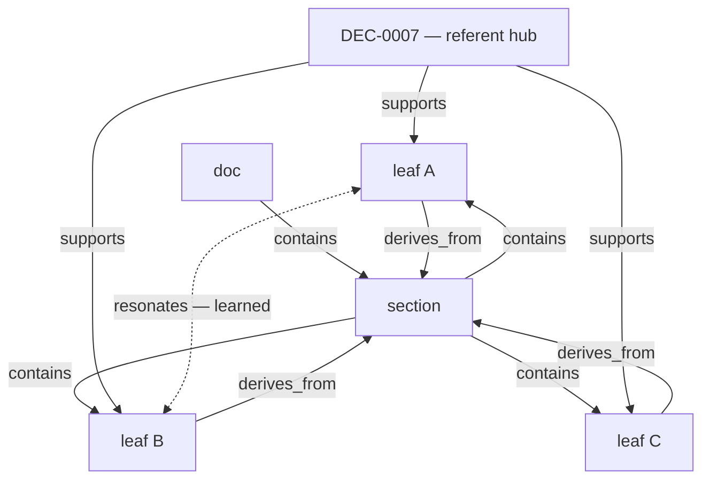
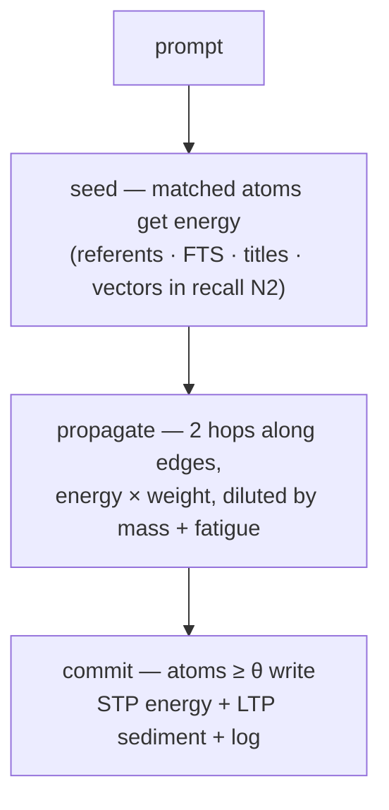
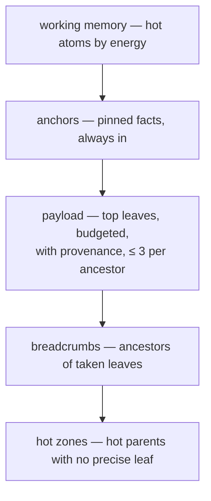
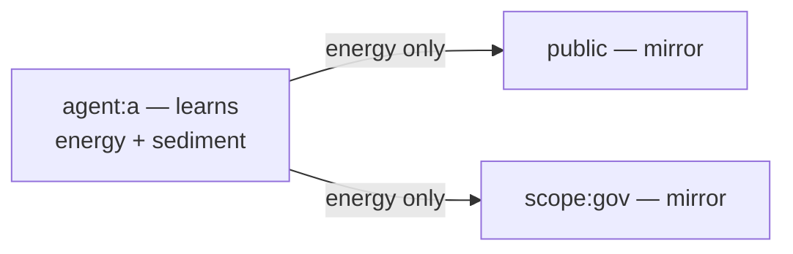

# How `@ytrynot/osem-rag` works

> Oscillo Ergo Memini — a deterministic memory-field engine in local SQLite.
> This document explains the physics: what an atom is, how a query becomes a
> wave, what gets remembered, and what gets forgotten.

## Table of Contents

- [Mental model](#mental-model)
- [The cadastre: atoms, links, planes](#the-cadastre)
- [A recall, step by step](#a-recall-step-by-step)
  - [1. Seeding — four surfaces](#1-seeding--four-surfaces)
  - [2. Propagation — the wave](#2-propagation--the-wave)
  - [3. Commit — STP vs LTP](#3-commit--stp-vs-ltp)
- [The two memories](#the-two-memories)
  - [STP: working memory (`agent_energy`)](#stp-working-memory)
  - [LTP: per-scope sediment (`atom_sediment`)](#ltp-per-scope-sediment)
- [Forgetting and fatigue](#forgetting-and-fatigue)
- [Injection — from field to context](#injection--from-field-to-context)
- [Memory planes and sharing](#memory-planes-and-sharing)
- [Honest silence](#honest-silence)
- [Maintenance (`maintain`)](#maintenance-maintain)
- [Determinism](#determinism)
- [Known limitations](#known-limitations)

---

## Mental model

OSEM is not a vector database with a recency filter. It is a **field**: atoms
of knowledge sit in a graph, a query injects energy at a few surfaces, the
energy propagates along edges, and whatever crosses a threshold becomes the
context. Everything that happened is written down — heat, hits, spacing,
fatigue — so the next query starts from a memory, not from scratch.

Two timescales coexist:

- **STP (short-term plasticity)** — *this agent's* working memory: what was
  recently hot for `agent:X`, decaying fast.
- **LTP (long-term plasticity)** — *per-scope* sediment: what each attention
  domain has learned is worth keeping, consolidated by spaced use **within
  that domain**.

The four public operations map to two directions — write and read:



Registration writes the graph; a recall reads the field **and writes back** —
that feedback loop is the memory.

| Step | Direction | What happens |
|---|---|---|
| `registerMemo` / `registerDoc` | write → field | inserts atoms, provenance edges, FTS index, embeddings |
| recall step 1: seed + propagate | field → read | the field's atoms and edges energize the wave |
| recall step 2: commit | write → field | hot atoms write STP energy + LTP sediment + audit log |
| `formatContext` | read | renders the working memory into a paste-ready block |
| `maintain` | write → field | erodes learned edges, prunes dead ones, refreshes stats |

## The cadastre

Everything lives in your SQLite database (you own the connection):

| Table | Role | Timescale |
|---|---|---|
| `atoms` | the knowledge units (id, body, kind, flag, src/line provenance) | — |
| `atom_sediment` | per-(atom, scope) LTP: salience, tau, uses, uses_spaced, touched_hit | LTP |
| `scope_clock` | each scope's own counters: `hit` (acting recalls) + `seq` (commits) | LTP |
| `scope_owner` | first writer = scope owner (pin certification) | LTP |
| `atom_links` | typed edges: `contains`, `derives_from`, `supports`, `resonates` | structural / learned |
| `agent_energy` | per-(atom, scope) working-memory energy | STP |
| `edge_gain` / `edge_fatigue` | learned edge weights and synaptic fatigue | adaptive |
| `surface_log` | every commit, every pruning — nothing is silent | audit |
| FTS5 + vec0 | lexical index and optional native vector index | surfaces |

An **atom** is one fact: a sentence, a row, a section. Parents exist too —
`fts: false` atoms that are reached by propagation only (they are context,
never payload).

**Edges**: `derives_from`/`contains` come from ingestion hierarchy;
`supports` links atoms to the referents they cite (`DEC-0006`, file paths);
`resonates` is the learned channel — edges the field itself creates between
co-surfaced atoms, with a gain that grows on reuse and erodes on neglect.



Leaves cite the same referent → the hub connects them. `doc`/`section` are
structural parents (`fts:false`): reached by propagation, rendered as
breadcrumbs, never payload.

## A recall, step by step

`recallShallow({ agentId, prompt })` runs the full wave. `recall` adds a
second escalation step (adjacent terms + vector surface) for harder queries.



### 1. Seeding — four surfaces

The prompt is decomposed into referents (governance ids, file paths), FTS5
terms (BM25-weighted, IDF-priced), and title matches. A fifth channel —
vector similarity — fires only in the cascade. Each surface injects energy at
the atoms it matches; an atom hit by several surfaces gets interference
(`srcs` tells you which).

### 2. Propagation — the wave

Energy flows along edges for up to two beam-bounded levels:

```text
e_neighbor = e_source × w_edge / √(1 + β·din)
```

- `w_edge` depends on the edge type (`supports` ≈ 0.6, `derives_from` ≈ 0.5)
  modulated by learned `edge_gain` and synaptic `edge_fatigue`;
- `din` dilution (`betaDin`) prevents hubs from irradiating everything —
  propagation is geometric in depth (`wⁿ`), so distance costs energy.

### 3. Commit — STP vs LTP

Atoms crossing `theta` commit: their energy is written into `agent_energy`
for the acting agent's plane, mirrored into any `share`d scopes, and logged.
LTP consolidation happens at the same moment — see below.

## The two memories

### STP: working memory

`agent_energy(atom_id, scope_id)` holds each plane's current heat. It decays
multiplicatively on every recall (`decaySession`), so yesterday's excitement
fades unless refreshed. This is the *context of now*: what this agent — or
this scope — has been thinking about.

| Plane | Address | Who reads it | What it holds |
|---|---|---|---|
| personal | `agent:<id>` | only that agent | own STP energy + LTP sediment + clock + owner |
| shared | `public` | every agent (default read) | mirrored energy; sediment only via owner `actAs` |
| domain | `scope:<name>` | callers passing `scopes: ["scope:<name>"]` | mirrored energy; sediment only via owner `actAs` |
| skill | `skill:<name>` | callers passing `scopes: ["skill:<name>"]` | mirrored energy; sediment only via owner `actAs` |
| union | `"all"` | read-only aggregate | every plane's energy summed |

Every plane is keyed `(atom, scope)` in `agent_energy` and `atom_sediment`,
and keeps its own monotonic `scope_clock`. By default the acting plane is
`agent:<id>` — but a shared scope **can** act, through its owner:
`recall({ agentId, actAs: "scope:gov" })` makes the scope the acting plane
(its energy, its sediment, its clock) if the caller is its `scope_owner`.
The first agent to actAs a scope claims ownership; later non-owner claims
are rejected before any write. That is how collective durable memory works:
curated by the owner, never open to every mirror.

### LTP: per-scope sediment

Each commit also writes the permanent trace into `atom_sediment`, keyed by
`(atom_id, scope_id)` — every attention domain consolidates **its own**
memory of the atom:

```text
salience  ← max( salience·2^(−Δt/τ),  ltpRate·energy )
uses_spaced += 1            when the hit was spaced (Δt ≥ τ/2)
tau       ← tau·(1 + κ·min(1, Δt/τ))  capped — memory matures
```

Read it as:

- the **impulse** rewrites salience to `λ·e` — it does not stack (the `max`
  is the anti-pumping guard: spam cannot inflate memory);
- **spacing** is what consolidates: `uses_spaced` only counts hits separated
  by at least half a `tau`, feeding a permanent floor
  `floorMax·(1 − e^(−uses/λ))` — the "productivity plateau";
- **`tau` matures**: well-spaced memories forget more and more slowly.

Effective salience is the max of the decayed hype, the earned floor, and the
flag floor (`pinned` > `high` > `medium`/`low`).

## Forgetting and fatigue

| Mechanism | What it does |
|---|---|
| salience decay | hype halves every `τ` hits (acting recalls on the scope) without a touch |
| STP decay | working memory cools ×`decaySession` per recall |
| `resonates` erosion | learned edges ×`erodeResonates` per `maintain`, pruned below `weightMin` |
| synaptic fatigue | over-used edges transmit less (`/(1+λ·uses)`), refilling ×0.5/recall |
| nodal fatigue | parents that keep surfacing get tired (bounded by `nodalWindow`) |

Nothing is deleted silently: pruning and forgetting are traced in
`surface_log`.

## Injection — from field to context

`formatContext()` renders the working memory into a paste-ready block with **two
pools**:

- **payload** — the leaf atoms, cited as answers with exact provenance
  (`source`, `section`, `lines`);
- **breadcrumbs** — their ancestors, cited as context — parents are context,
  never payload, and a per-ancestor diversity cap keeps one big document from
  eating the budget.

Pinned atoms (`flag: "pinned"`) are anchors: they bypass the energy ranking
and are always available to the pool.



## Memory planes and sharing

One mechanism, four addressing modes — `agent:<id>` (private working
memory), `public`, `scope:<name>`, `skill:<name>` — plus `"all"` as a
read-only union. `share` on `recall`/`recallShallow` mirrors the wave's
energy into shared planes without double learning.

**Every scope is an attention domain**: it owns its sediment
(`atom_sediment` keyed by `(atom_id, scope_id)`), its clock (`scope_clock`,
monotonic — a stale caller can never rewind a plane), and its owner
(`scope_owner` — the first writer, used for pin certification). Mirrors
receive the wave's energy and trace but **never** touch the sediment:
sharing a prompt must not accelerate consolidation.



The acting plane consolidates once; mirrors hold heat, never sediment.

## Honest silence

If nothing crosses the thresholds — lexical empty AND both vector channels
under their cosine gates — the engine surfaces **nothing**. No fabricated
top-k, no low-confidence padding. An empty answer is a correct answer.

## Maintenance (`maintain`)

`maintain()` erodes learned edges, prunes the dead ones (traced), and refreshes
the materialized propagation statistics (`_fan`, `_mass`, `_din`) that keep
wave computation sub-linear. One `IOsemRag` handle = one writer per
connection.

## Determinism

No wall-clock anywhere in the physics — and no caller clock either: each
scope counts its own hits (acting recalls) and commits. Same database +
same prompt + same history ⇒ same wave, byte for byte.
That is what makes the engine testable, replayable, and auditable.

## Known limitations

- **Per-scope isolation of LTP**: sediment only consolidates on the *learning*
  plane — the agent's own scope. Shared planes mirror energy but hold no
  sediment of their own until their owner acts for them (`actAs`).
- **Commit-time learning**: consolidation currently rewards every committed
  atom, including propagation bystanders that were never injected. An
  injection-gated variant is under evaluation (see docs addendum).
